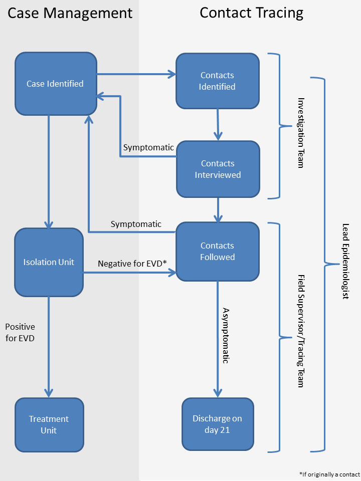

# Three core steps

### 1. Contact the confirmed case \(“Case identification”\)

1. Interview the confirmed case \(i.e., person diagnosed with COVID-19\), likely by one-on-one telephone interview, and determine symptoms, date of exposure, infectious period, and high-risk conditions.
2. Provide the case with education on COVID-19.
3. Provide the case with instructions on isolation and connect to any additional support needed \(e.g., nutrition, social services, housing\).
4. Elicit all possible exposed contacts during infectious period.

### 2. Notify, interview, and quarantine contacts \(“Contact location and notification”\)

1. Identify contacts if necessary and locate contact information.
2. Engage contacts to notify them of their exposure.
3. Provide education on COVID-19.
4. Provide contact with recommendation/referral for clinical evaluation and appropriate testing if symptoms are present. If test results are positive, the person would require full case investigation in order to elicit their contacts.
5. Provide instructions on quarantine and connect to any additional support needed \(e.g., nutrition, social services, housing\).

### 3. 14-day contact monitoring \(“Contact follow-up”\)

1. Ensure daily temperature checks and symptom monitoring for 14 days since last contact with the confirmed case.
2. Ensure continued quarantine of contact for 14 days since last contact to the confirmed case.
3. Provide contact with recommendation/referral for clinical evaluation and appropriate testing if symptoms develop. If test results are positive, the person would require full case investigation in order to elicit their contacts.



